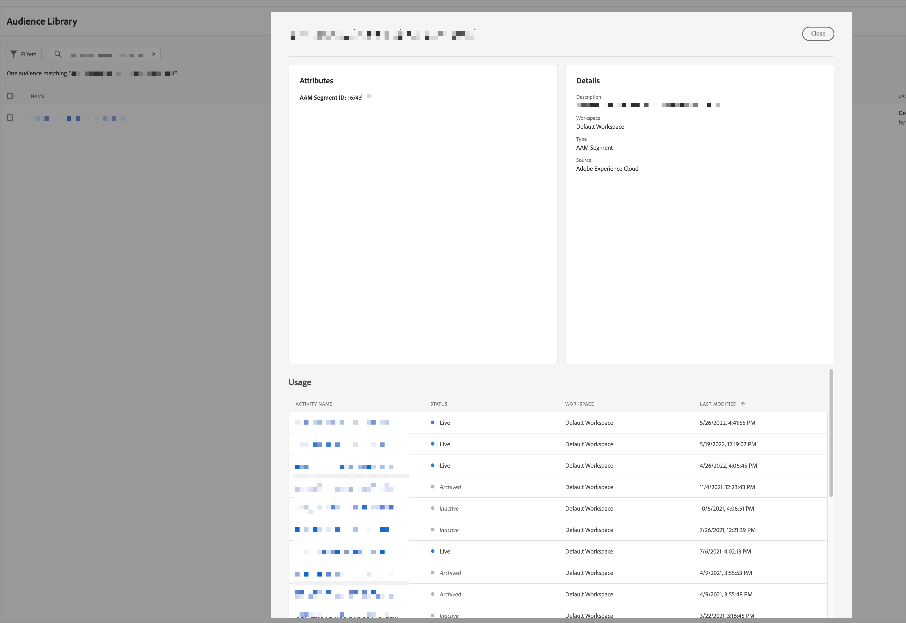

# Understand the usage of AAM segments in Adobe Target

Once Audience Manager is integrated with Target, all of Audience Manager segments will appear in Target shortly after the implementation process. These segments can thus be used in Target activities to provide personalized experiences to users. 


One typical post-implementation operational task marketers need to do is to clean up unused AAM audiences on a regular basis. How ever, as the numbers of Target activities and AAM audiences keep growing, this task becomes harder and harder. The reason is that to find out all activies an audiences is used in, needs to open the audience details dialog manually. This is a manual process and will be very time consuming when there are hundreds of audiences to be checked. 



This document aims to provide a way to quickly generate a report of tall AAM segments and their associated Target activities to address the pain point described above.

## 1 - Prepare the environment  

To be able to perform the task, one needs to have Observer's access to the Target instance. Once logged in to Target, navigate to Audiences tab.

Once on the Audiences tab, bring up the Developer Tools of the browser, and open the Console tab.

## 2 - Run the script 

Run the following code snippet in Console. After running the code, type `window.b` in console to get the result.

> `window.fails` contains details on why the requests are failed.
> Change `pageSize` or `page` in the code to control the number of audiences to be queried.

**Javascript Code**
```javascript
function getRandom(length) {
    return Math.floor(Math.pow(10, length-1) + Math.random() * 9 * Math.pow(10, length-1));
}

var trgAudList = $.get("/content/mac/" + location.host.split(".")[0] + "/target/audiences.at.json?pageSize=500&page=1&_=" + getRandom(13), function(a) {
    a = a.items;
    window.fails = [];
    if (!window.b)
	    window.b = "targetSegmentID\tSegmentName\taamSegmentURL\tActivityID\tActivityName\tActivityType\tActivityStatus\tActivityModifiedBy\n";
	for (item in a) {
		if (a[item].source == "Marketing Cloud") {
            (function(targetId, reference, targetSegmentName, editUrl){
                $.get("/content/mac/" + location.host.split(".")[0] + "/target/activities.referring.audience.at.json?segmentId=" + targetId + "&audienceRef=" + reference + "&_=" + getRandom(13), function(abc) {
                    if (abc.total > 0) {
                        for (var i = 0; i < abc.total; i++){
                            var activity = abc.activityMetadataSet[i];
                            b += targetId + "\t" + targetSegmentName + "\t" + editUrl + "\t" + activity.id + "\t" + activity.name + "\t" + activity.type + "\t" + activity.status + "\t" + activity.modifiedBy + "\n";
                        }
                    }
                }).fail(function() {
                    failAudience = {
                       "targetId" : targetId,
                       "reference" :reference,
                       "targetSegmentName" : targetSegmentName,
                       "editUrl" :editUrl
                    }
                    fails.push(failAudience);
                    console.log( "an error happened, push to fails array" );
                });
            })(a[item].targetId, a[item].reference, a[item].targetSegmentName, a[item].marketingcloudmetadata.editUrl)
		}
	}

});
```

## 3 - Generate the report

The text contains result is TAB delimited with header row. Import it to Excel to get the final reprot.

